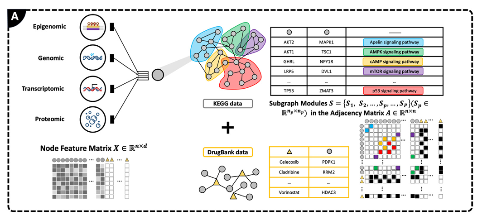
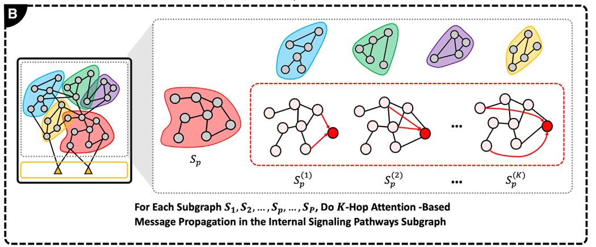
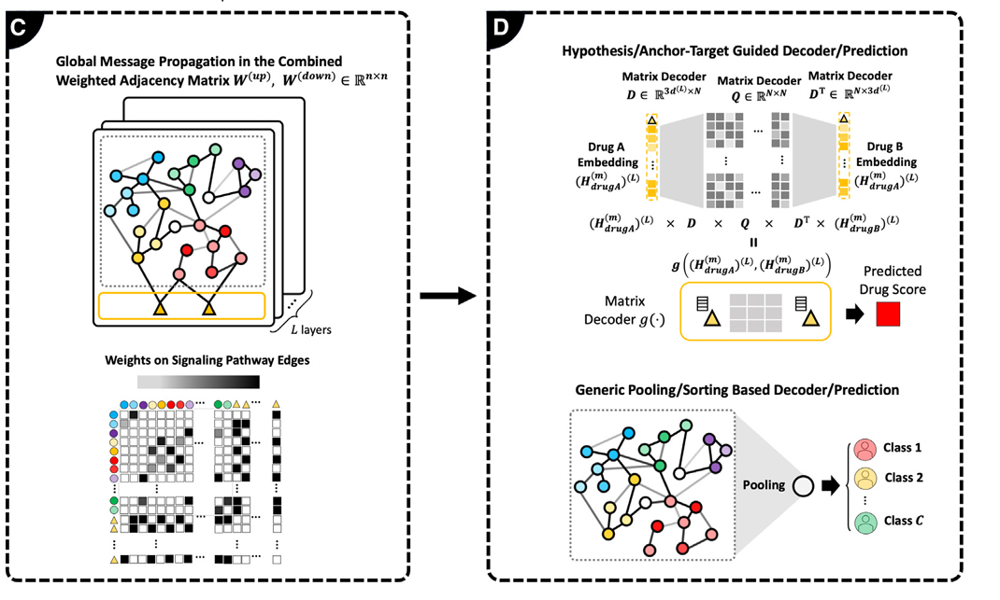

# M3NetFlow：用于整合多组学数据分析的多尺度多跳图AI模型

---

关键需求

1. 假设驱动分析：已知“靶点”（如药物作用目标），想知道它影响哪些通路
2. 通用发现分析：不知道靶点，想从病人数据中直接找出新的疾病标志物

---

核心思路

数据预处理

输入：多组学数据、KEGG通路图、已知的药物靶点或疾病相关基因

处理：将多组学数据作为特征，赋给KEGG图中的每个蛋白质节点

输出：带特征的图（节点特征矩阵 `X` + 邻接矩阵 `A`）

核心，多跳注意力消息传递

将整个KEGG大图切割成多个功能子图，在每个子图内部进行 K-hop注意力消息传播

模块C整合，融合所有子图的节点信息。在全局图上进行双向消息传播

模块D输出（对应两种需求）

假设引导型解码器

适用场景：目标已知（如 “药物 A + 药物 B 的协同机制”）

输入：药物 A、药物 B 的靶点信息，以及全局图的节点特征

输出：药物组合的协同评分

通用池化型解码器

适用场景：目标未知（如 “区分 AD 患者与健康人”）

输入：全局图的节点特征

输出：样本分类结果
