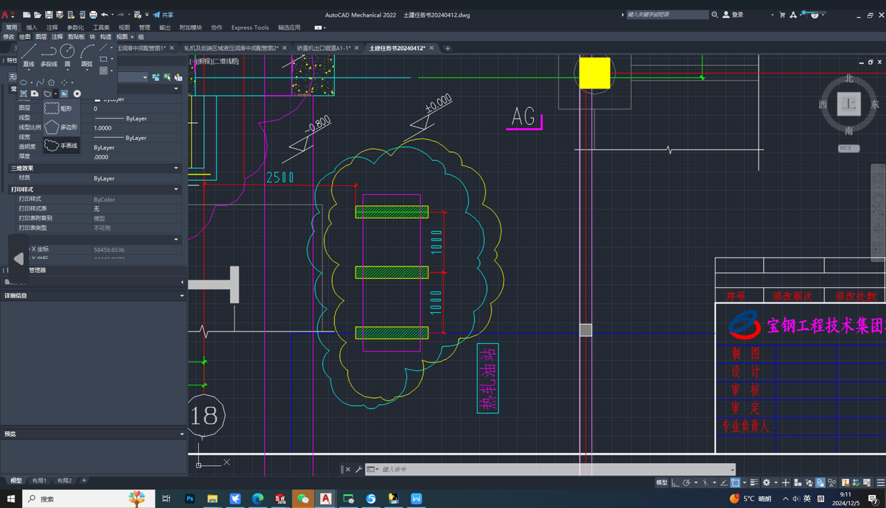
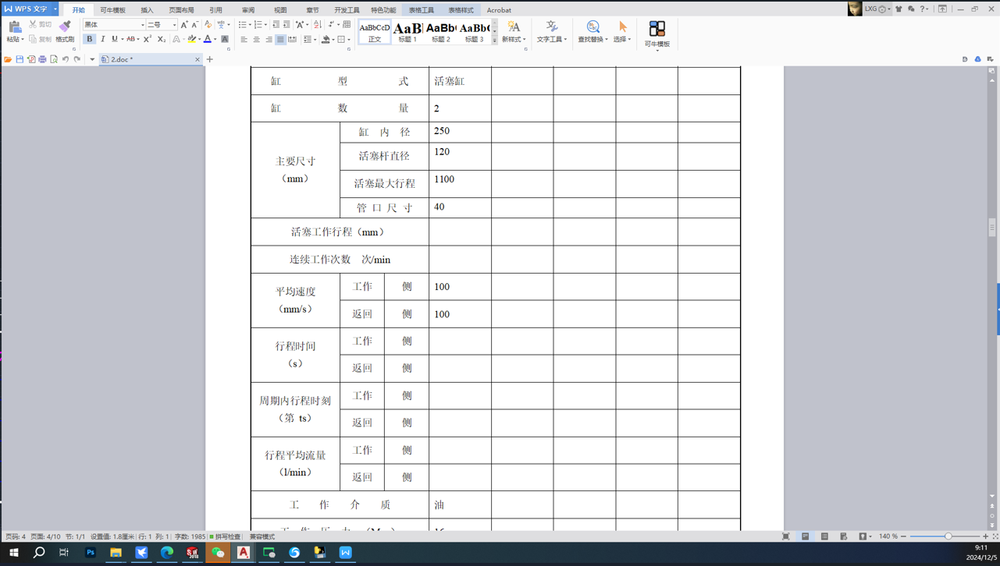
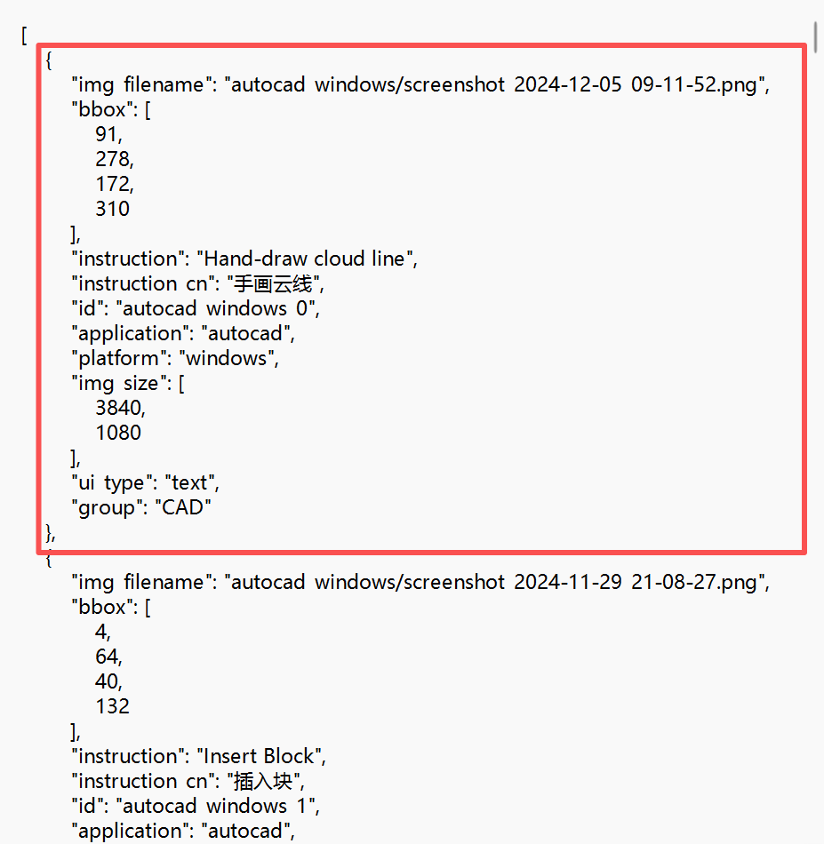

# ScreenSpot-Pro

数据集构成：一张图片对应一段json格式的指令描述

工业软件：cad,solidworks,inventor,vivado

前两张图在数据集里是一张完整的图片，实际点击按钮占整个图片很小很小的一部分，比较难看清我就把两块屏幕分开了。
红框不是数据集中自带的的，是我下载下来之后用程序结合数据集的图片还有json中的bbox标的像素点位置标注的，程序标注的时候我用的是完整的图片

整个数据集的采集过程是实际工程师工作环境，使用双屏工作，右边word文档是工作时看的任务说明，左边是实际使用软件界面，截图是论文团队自己开发的一款后台静默截图工具，工程师按下快捷键，图片就会以一种半透明的形式覆盖在屏幕上，然后工程师再框住自己当前操作的地方，输入指令描述当前操作，然后bbox里的四个数就是第一张图框框的左上角和右下角的横纵坐标，然后就是ui type字段，只要操作的ui有文本信息就是text,否则就是icon类。
