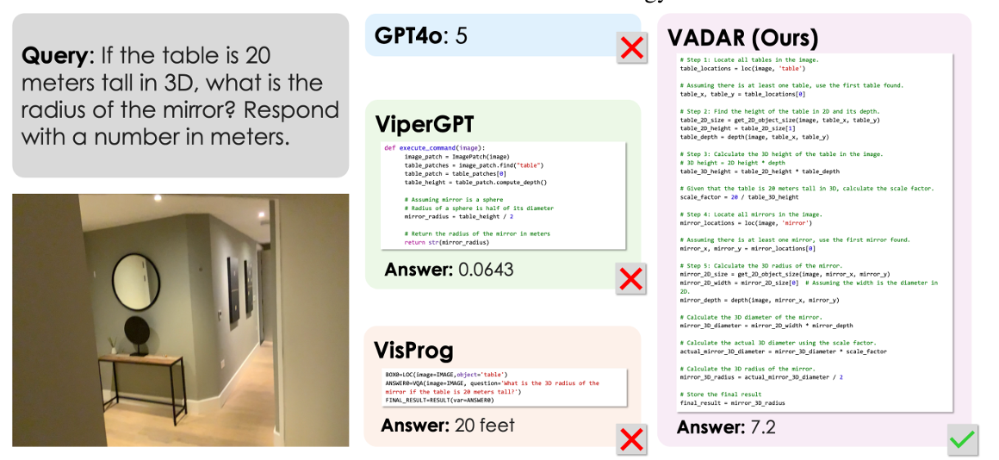
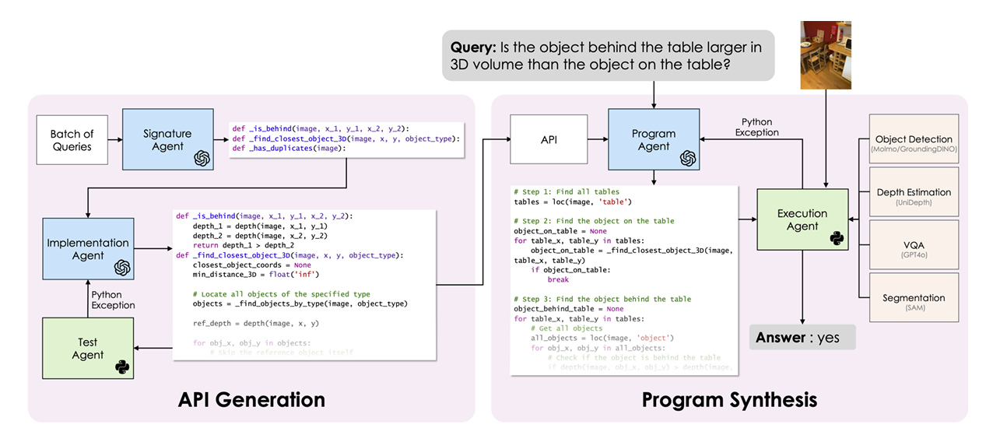
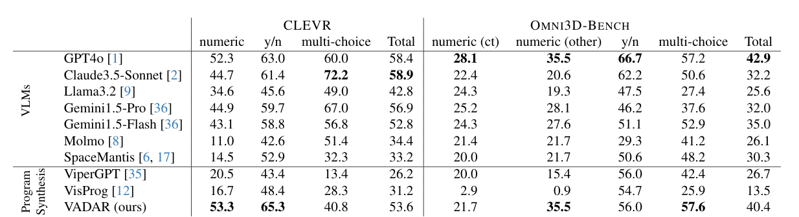
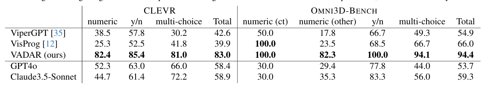

# VADAR：多智能体协同动态生成API进行3D空间推理

---

## 问题：猜镜子半径

- 如果图中的桌子实际高20米，那么镜子的半径是多少？
-
- **方案一：面向空间推理的视觉语言模型**：
  - 直接用大量数据训练一个模型，将图片和问题输入后让它直接给出答案。
- **方案二：视觉程序合成**：
  - 让模型思考如何解决这个问题，并将想出来的解决方法编写成一个可执行的程序，通过运行程序来得到答案

---

## VADAR的思路

由大语言模型生产动态API,API的目标是将复杂的推理问题分解为更简单的子问题，最终生成可执行程序。

---

## 实验结果

