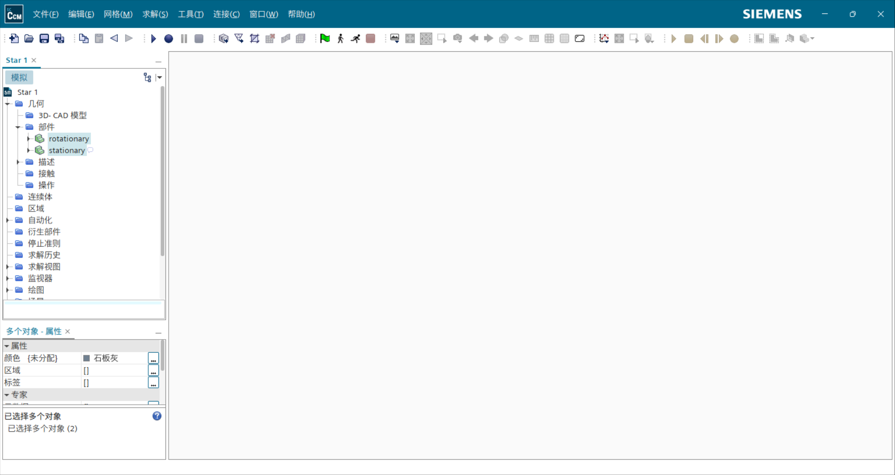
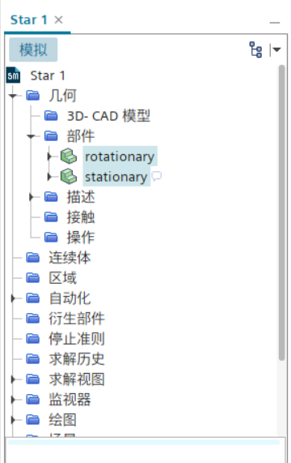
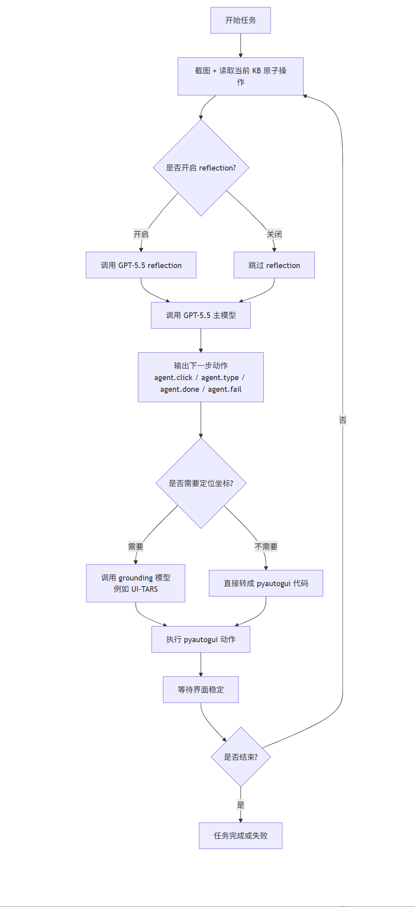
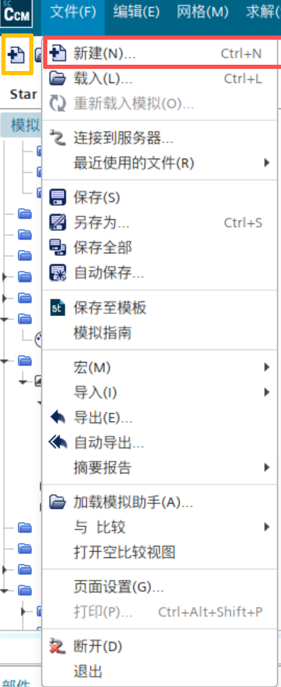
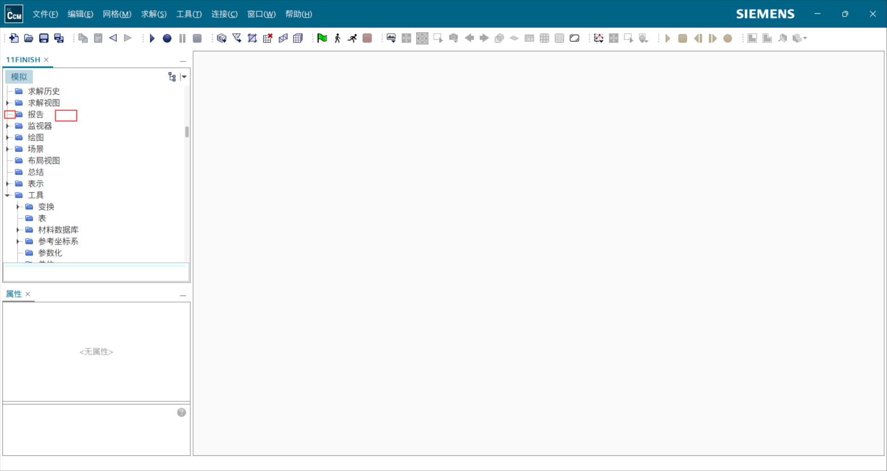
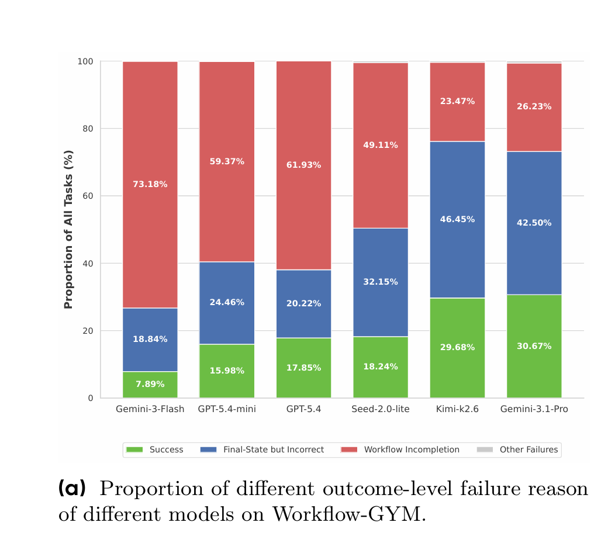
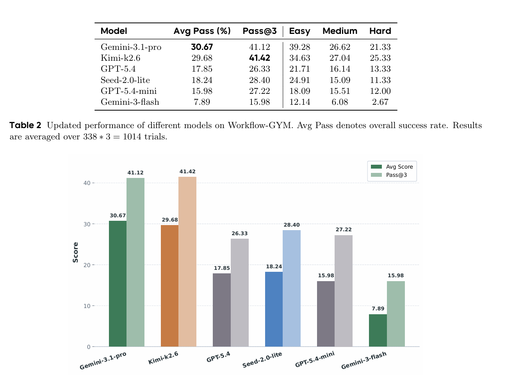

### steps_kb
## 步骤 1：新建项目

- 序号：1
- 依赖：无
- 说明：新建一个并行计算项目，设置计算进程数为20，等待初始化结束

## 步骤 2：导入旋转部件网格

- 序号：2
- 依赖：步骤1
- 说明：以毫米为单位导入 rotationary.stl 表面网格文件，不自动打开几何视图

## 步骤 3：导入静止部件网格

- 序号：3
- 依赖：步骤2
- 说明：以毫米为单位导入 stationary.stl 表面网格文件，不自动打开几何视图

## 步骤 4：区域划分

- 序号：4
- 依赖：步骤3
- 说明：将 rotation 和 stationary 两个几何部件分配到仿真区域，并为每个部件创建区域和边界

### actions_kb
## 步骤 4：区域划分

1. 展开工作树：展开“几何” -> “部件”`
2. 多选部件：按住 Ctrl 键，依次点击选择 "rotation" 和 "stationary"
3. 右键菜单：在选中的部件上右键 -> `将部件分配给区域`
4. 选择选项：在弹出的第一个选项中选择“为每个部件创建一个区域”
5. 选择选项：在第二个选项中选择“为每个部件表面创建一个边界”
6. 点击按钮：点击 `应用`
7. 验证：在区域节点下确认出现 rotation 和 stationary 区域及其边界

---

### new_actions_kb
- 左点击“文件”菜单
  
  --按钮坐标{[62,21]}
  
  --按钮UI元素描述：
  {
  
  1.位置简述[窗口左上角菜单栏，在 STAR-CCM+ 图标右侧，在“编辑”菜单左侧]
  
  2.形状[除文字外无明显按键形状，横向菜单文字]
  
  3.作用简述[打开文件菜单，下层可选“新建”等文件级命令]
  
  4.包含/临近下层UI元素[新建；打开；保存；导入]
  }
  

1. 右键“报告”节点文本
--按钮UI元素描述：
  {

   1.位置简述[左侧工作树中，在“求解视图”下方，在“监视器”上方]

   2.形状[树节点文字，左侧有文件夹图标]

   3.作用简述[打开报告节点右键菜单，用于创建后处理报告]
   
  }

### 补充：workflow-gym 长流程 GUI benchmark

| 难度 | 步数范围 | 任务数 | 占比 |
|---|---:|---:|---:|
| Easy | 30-44 | 129 | 38.2% |
| Medium | 45-60 | 159 | 47.0% |
| Hard | 61-110 | 50 | 14.8% |

 当前模型在短任务或网页任务上的能力，不能直接迁移到专业长流程任务。
 GUI agent 的瓶颈不是单一模块，而是感知、规划、执行、记忆、验证共同叠加后的系统性问题。

1. 结果层失败：模型没有真正走完整个流程，也没有到达任务要求的最终状态。（低性能模型一般卡在这）
2. 长程行为失败：模型早期做错一步，导致当前工作流状态偏离正确轨迹。
3. 执行层失败：模型缺少特定专业软件的操作知识，无法正确理解功能、选择合适操作，或导航到正确工具。它可能会选错菜单、反复搜索不存在的功能，或者不知道应该用哪个工具完成任务。

